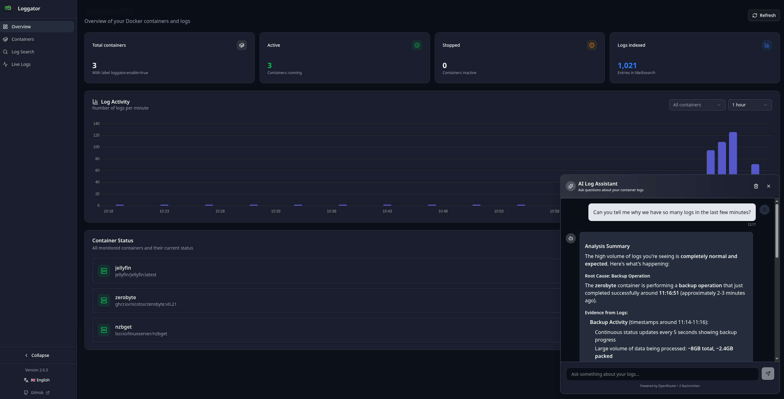

<p align="center">
  
</p>

<h1 align="center">Loggator</h1>

<p align="center">
  <strong>Docker Log Aggregator with AI-Search, powered by Meilisearch and OpenRouter</strong><br>
  Collect, index, and search container logs with a modern web UI and a AI assistant.
</p>

<p align="center">
  <a href="#quick-start">Quick Start</a> •
  <a href="#features">Features</a> •
  <a href="#configuration">Configuration</a> •
  <a href="#api">API</a> •
  <a href="#development">Development</a>
</p>



---

## Quick Start

```yaml
# docker-compose.yml
services:
  loggator:
    image: ghcr.io/mbeggiato/loggator:latest
    ports:
      - '3000:3000'
    environment:
      - MEILISEARCH_HOST=http://meilisearch:7700
      - MEILISEARCH_API_KEY=your-secret-key
    volumes:
      - /var/run/docker.sock:/var/run/docker.sock:ro
    depends_on:
      - meilisearch

  meilisearch:
    image: getmeili/meilisearch:v1.6
    environment:
      - MEILI_MASTER_KEY=your-secret-key
    volumes:
      - meilisearch-data:/meili_data

volumes:
  meilisearch-data:
```

```bash
docker-compose up -d
# Open http://localhost:3000
```

### Enable logging for containers

Add label to containers you want to monitor:

```yaml
services:
  my-app:
    image: my-app
    labels:
      - 'loggator.enable=true'
```

## Features

- 🤖 **AI Log Assistant** - Chat with an AI about your logs using OpenRouter
  - Natural language queries: "Show me all errors from the last hour"
  - Automatic tool calling for log search, container info, and health checks
  - Chat history persistence across sessions
  - Markdown responses with syntax highlighting
- 🔍 **Full-text search** - Fast log search powered by Meilisearch
- 📊 **Real-time dashboard** - Live log streaming and statistics
- 🐳 **Label-based filtering** - Only monitor containers you choose
- 🌐 **Multi-language UI** - English and German support
- 🔔 **Update notifications** - Get notified of new releases
- 📈 **Log histograms** - Visualize log activity over time

## Configuration

### Required Variables

| Variable                | Default                     | Description            |
| ----------------------- | --------------------------- | ---------------------- |
| \`MEILISEARCH_HOST\`    | \`http://meilisearch:7700\` | Meilisearch URL        |
| \`MEILISEARCH_API_KEY\` | -                           | Meilisearch API key    |
| \`DOCKER_LABEL_FILTER\` | \`loggator.enable=true\`    | Container filter label |
| \`PORT\`                | \`3000\`                    | Web UI port            |

### AI Chat Configuration (Optional)

To enable the AI Log Assistant, add these environment variables:

| Variable               | Default                       | Description                       |
| ---------------------- | ----------------------------- | --------------------------------- |
| \`OPENROUTER_API_KEY\` | -                             | Your OpenRouter API key           |
| \`AI_MODEL\`           | \`xiaomi/mimo-v2-flash:free\` | OpenRouter model to use           |
| \`SITE_URL\`           | \`http://localhost:3000\`     | Your site URL for OpenRouter logs |

Get your free OpenRouter API key at: https://openrouter.ai/keys

**Available AI Tools:**

- \`search_logs\` - Search logs using Meilisearch with filters
- \`list_containers\` - List all Docker containers
- \`get_container_info\` - Get detailed container information
- \`analyze_container_health\` - Analyze container health status

## API

### Chat with AI

```bash
POST /api/chat
Content-Type: application/json

{
  "messages": [
    { "role": "user", "content": "Show me all errors" }
  ]
}
```

### Search logs

```bash
GET /api/logs/search?q=error&container=nginx&limit=50
```

### List containers

```bash
GET /api/logs/containers
```

### Get container info

```bash
GET /api/containers/:id
```

### Health check

```bash
GET /api/status
```

### Get version

```bash
GET /api/version
```

## Development

### Local Development with Hot-Reload

For local development with instant code updates:

```bash
# Start required services (Meilisearch + Test-Logger)
bun run dev:services

# Start dev server with hot-reload
bun run dev

# Or start everything at once
bun run dev:full
```

The app runs on: **http://localhost:5173** (with hot-reload)

**What's running:**

- SvelteKit Dev Server: `localhost:5173` (hot-reload enabled)
- Meilisearch: `localhost:7700` (Docker container)
- Test-Logger: Docker container for testing

**Stop development services:**

```bash
bun run dev:stop
```

### Production Build

Build and run with all services in Docker:

```bash
docker compose down && docker compose up -d --build
```

App runs on: **http://localhost:3000**

### Environment Files

- **`.env.development`** - Local development (localhost URLs)
- **`.env`** - Production/Docker (container URLs)

### Other Commands

```bash
# Install dependencies
bun install

# Type check
bun run check

# Format code
bun run format

# Lint
bun run lint
```

See [DEVELOPMENT.md](DEVELOPMENT.md) for detailed development guide.

## Tech Stack

- **Frontend**: SvelteKit 2 + Svelte 5 (with runes)
- **AI**: OpenRouter (multi-model support)
- **Search**: Meilisearch
- **Docker**: dockerode
- **Runtime**: Bun
- **UI**: Tailwind CSS + shadcn-svelte
- **Markdown**: marked + highlight.js
- **i18n**: Custom translation system (DE/EN)

## Features in Detail

### AI Log Assistant

The AI assistant can help you analyze your Docker logs through natural conversation:

- **Automatic Tool Selection**: The AI automatically chooses the right tools to answer your questions
- **Context-Aware**: Understands container names, log levels, and time ranges
- **Markdown Formatting**: Responses include formatted tables, code blocks, and lists
- **Persistent Chat**: Your conversation history is saved in your browser
- **Multi-Language**: Works in German and English

**Example Queries:**

- "Show me all errors from the last hour"
- "Which containers are currently running?"
- "What happened with the nginx container?"
- "Analyze the health of my database container"

### Development Workflow

This project supports two development modes:

1. **Local Development** (`bun run dev:full`) - Hot-reload for fast iteration
2. **Production Build** (`docker compose up --build`) - Full containerized deployment

The local development setup uses:

- `.env.development` for localhost configuration
- `docker-compose.dev.yml` for minimal service requirements
- Automatic environment switching based on `NODE_ENV`

## License

MIT © [Marcel Beggiato](https://github.com/MBeggiato)
